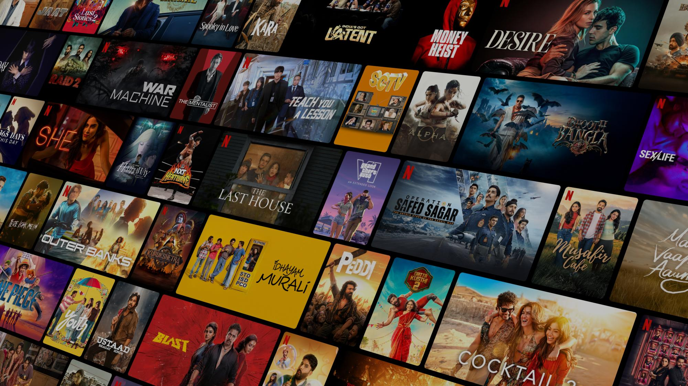

  

<h1 align="center">🎬 Netflix Clone</h1>

  A modern Netflix-inspired streaming web app built with React, Tailwind CSS, Node.js and MongoDB.

  
  
  
  
  

## 🚀 Live Demo

🔗 **[View Live Project](https://netflix-app-amber.vercel.app)**

## 🚀 Live Demo

👉 **Experience it here:** 🔗 [View Live Project](https://netflix-app-amber.vercel.app)
📌 About

This project is a Netflix-inspired movie and TV streaming interface created to practice and demonstrate real-world frontend and backend development.

It includes movie discovery through the TMDB API, user authentication, profiles, search, movie details, My List, responsive layouts and a separate Node.js backend.

✨ Features

🎬 Browse movies and TV shows

🔥 Trending & popular content

⭐ Top-rated movies and shows

🔎 Search movies and TV shows

📺 Movie player/details experience

❤️ Add and remove titles from My List

👤 User signup & login

🔐 JWT-based authentication

👨‍💻 Profile management

🗄️ MongoDB database integration

📱 Responsive Netflix-style UI

⚡ Fast Vite development setup

🎨 Tailwind CSS styling

🧭 React Router navigation

🔄 Protected routes for authenticated pages

🛠️ Tech Stack

Technology

Used For

React

Frontend UI

Vite

Development & build

Tailwind CSS

Responsive styling

React Router

Page navigation

JavaScript

Application logic

TMDB API

Movie & TV data

Axios / Fetch

API requests

Node.js

Backend runtime

Express.js

REST API

MongoDB + Mongoose

User & profile data

JWT

Authentication

bcryptjs

Password hashing

Git & GitHub

Version control

🏗️ Project Structure

Netflix App/
├── Frontend/
│   ├── public/
│   ├── src/
│   │   ├── components/
│   │   ├── pages/
│   │   ├── services/
│   │   └── assets/
│   ├── package.json
│   └── vite.config.js
│
└── Backend/
    ├── src/
    │   ├── config/
    │   ├── controller/
    │   ├── MiddleWare/
    │   ├── models/
    │   ├── Routes/
    │   └── server.js
    └── package.json

⚙️ Getting Started

1. Clone the repository

git clone YOUR_GITHUB_REPOSITORY_URL
cd "Netflix App"

2. Start the Frontend

cd Frontend
npm install
npm run dev

3. Start the Backend

Open another terminal:

cd Backend
npm install
npm run dev

4. Environment Variables

Create .env files for the required API and database configuration.

Frontend example:

VITE_TMDB_TOKEN=your_tmdb_token
VITE_API_URL=your_backend_url

Backend example:

MONGO_URI=your_mongodb_connection_string
JWT_SECRET=your_jwt_secret
PORT=10000

Never upload real API keys, database credentials or JWT secrets to GitHub.

🎯 What I Built

This project helped me work with:

Component-based React architecture

API integration and data fetching

Authentication and protected routes

JWT-based login system

MongoDB data handling

Responsive UI development

Search and filtering interactions

Local My List functionality

Frontend + backend integration

Deployment and production routing

📈 Future Improvements

🎥 Real video streaming

👥 Multiple user profiles

💳 Subscription/payment integration

🎯 Personalized recommendations

📥 Download/watch offline

🌐 Multi-language support

⚠️ Disclaimer

This is a personal learning project inspired by Netflix's interface and user experience. It is not affiliated with or endorsed by Netflix.

Movie and TV information is provided through the TMDB API.

👨‍💻 Author

Piyush Pal

Built as a full-stack web development project using modern React and Node.js technologies.

  ⭐ If you like this project, consider giving the repository a star!

